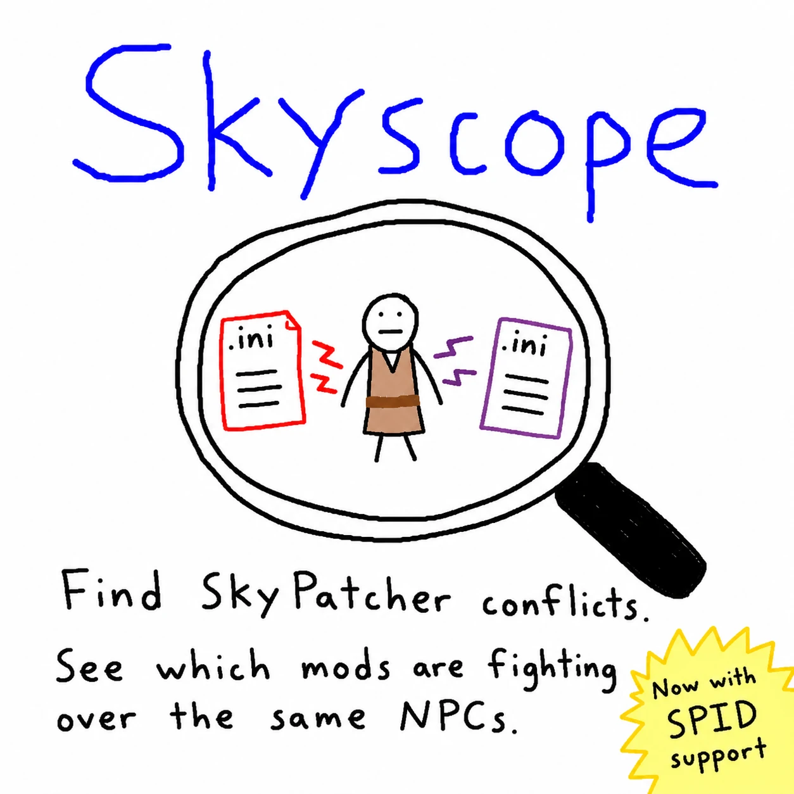

# SkyScope

A small tool for finding SkyPatcher conflicts. If you have multiple NPC overhauls installed there's a decent chance some of them are fighting over the same NPCs through SkyPatcher config files. SkyScope scans those configs and tells you exactly which ones are winning the conflict and allows you to select which you want to win instead by commenting out the other conflicts.

## What it does

- Scans `Data\SKSE\Plugins\SkyPatcher` (both `npc` and `outfit` subdirectories) and finds INI rules that target the same NPC with the same rule type across multiple mods
- Resolves NPC names and EditorIDs from your plugin files so you see "Lydia" instead of `Skyrim.esm|13480`
- Shows the exact conflicting lines with surrounding context, and which file wins based on SkyPatcher's load order (alphabetical by full path)
- Lets you fix a conflict directly: hover a result in the detail view and click **Make Winner** to have SkyScope comment out the losing rules

## Requirements

- Windows 10 or later

## Installation

Download the latest release, extract it somewhere, run `SkyScope.exe`.

## Usage

Point it at your Skyrim game directory and click **Analyze Mods**. It'll try to auto-detect common Steam and Bethesda Launcher paths on startup so you may not need to do anything.

Once results are in, hover any row for a quick summary or double-click to open the detail view. The detail view shows the raw lines from each conflicting file with the line above and below for context, listed in SkyPatcher load order so it's clear which one wins. Hover any file card and click **Make Winner** to comment out the conflicting rules in all the other files. SkyScope adds a `; Rule commented out by SkyScope` marker above each commented line so they're easy to find and revert. Re-run the analysis afterwards to confirm the conflict is resolved.

**Export Report** saves everything to a timestamped text file if you want a record before making changes.

---

### Mod manager setup

**Manual installs and Vortex** work out of the box. Vortex deploys mod files directly into your Data folder so SkyScope sees them the same as a manual install.

**MO2 is a bit different.** MO2's virtual filesystem only exists while something is running through MO2, so if you launch SkyScope normally it won't see any of your mod files. The easiest fix is to add SkyScope as an executable inside MO2 — go to Tools → Executables, click Add from file, and point it at `SkyScope.exe`. Launch it from the MO2 toolbar and the VFS kicks in automatically.

---

### Screenshots

---

### Conflict types

SkyPatcher has three rule types that SkyScope checks for conflicts:

- **Appearance** — `copyVisualStyle` rules that copy a visual template from one NPC onto another
- **Skin** — `skin` overrides
- **Default Outfit** — `outfitDefault` assignments

In all cases, when two or more mods target the same NPC with the same rule type, the file that sorts last alphabetically by its full path wins. SkyScope shows you the load position of each file in the detail view.

---

### NPC portraits / thumbnails

Appearance conflicts can show a portrait of the NPC next to each source so you can see at a glance who's being changed. Portraits are opt-in and configured per plugin in the **Settings** tab.

After you run an analysis, the Settings tab lists every plugin referenced by the appearance conflicts. For each one, pick a folder that contains that plugin's portrait images, then click **Save Settings** (your choices are written to `settings.json` next to the exe and remembered between launches). The red trash button next to a saved folder removes it.

SkyScope finds a portrait by looking in the configured folder — including all subfolders — for an image named after the NPC's **Form ID**, shown as an 8-digit hex value in the conflict view (e.g. `000135E6`). So an NPC with Form ID `000135E6` needs a file called `000135E6.png`. Supported extensions are `.png`, `.jpg`, and `.jpeg`.

The best source of ready-made portraits is this Nexus collection of NPC face thumbnails: **https://www.nexusmods.com/skyrimspecialedition/mods/97595** — its images are already named by Form ID, so you can point a plugin straight at the relevant folder and the portraits will resolve automatically.

---

## Contributing

Issues and pull requests are welcome.

## License

Provided as-is for the Skyrim modding community.
